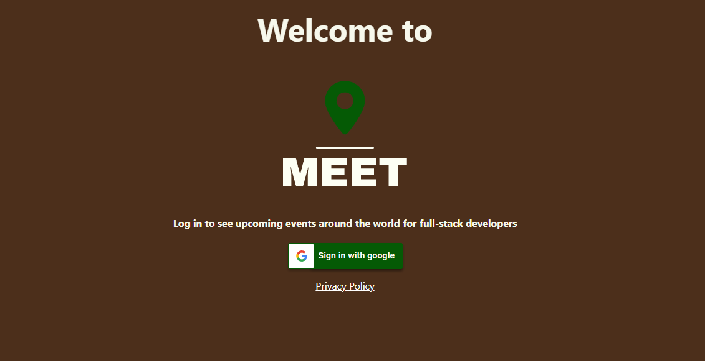

# meet

## Purpose
To build a serverless, progressive web application (PWA) built with React using a test-driven
development (TDD) technique. The application uses the Google Calendar API to fetch
upcoming events.

[Live project here] (https://priegels.github.io/meet/)

### Preview

Login View:
 
Access to the app is gained by signing in with a Google account. 

Main View: 
 
On the main page users can search for events from different cities, specify a number of events they want the app to display and view visualization of the search data. 

## Key Features
1. The app uses OAuth2 authentication flow to allow the user to login.
2. Users can install the app on their desktop or add it to their mobile home screen.
3. The app is usable when offline.
4. Users can filter events by city and specify the number of events shown on screen.
5. A details button is clickable that will reveal additional info about an event.
6. A Piechart and a Scatterplot visualize data about the displayed events.

## User Stories

### Feature 1: Filter Events by City

#### User Story
As a user I should be able to filter the events by city so that I can see the list of events that take place in that city

#### Scenarios

**Scenario 1: When a user has not searched for a city, show upcoming events from all cities.**

- Given a user has not searched for a city,
- When the user opens the app,
- Then the user should see all upcoming events from all cities.

**Scenario 2: A user should see a list of suggestions when they search for a city.**

- Given a user wants to see all upcoming events in a specific city,
- When the user starts typing in the search bar,
- Then the user should see a list of suggestions of cities.

**Scenario 3: A user can select a city from the suggested list.**

- Given a user types the name of a city in the input field,
- When the list of suggestions appears,
- Then the user can select that city for detailed view of events.

### Feature 2: Show/hide an event's details

#### User Story:
As a user, I should be able to show or hide an event's details so that I can see what an event is all about or hide that information. 

#### Scenarios

**Scenario 1: An event element is collapsed by default**

- Given the app is loaded
- When the list of events is displayed
- Then the event elements are collapsed by default

**Scenario 2: A user can expand an event to see its details**

- Given the event element is collapsed by default
- When the user clicks on the "Show Details" button for an event
- Then the event element will be expanded to show the event details

**Scenario 3: A user can collapse an event to hide its details**

- Given the event element has been expanded to show details
- When the user clicks on the "Hide Details" button for an event
- Then the event element will collapse to hide its details 

### Feature 3: Specify number of events

#### User Story: 
As a user, I should be able to specify the number of events, so that I can see just how many events are going on in my city of choice.

#### Scenarios

**Scenario 1: When a user has not specified a number of events, 32 is the default number**

- Given the user has loaded the app
- When the user has not specified a number of events
- Then the default number of events is 32

**Scenario 2: A user can change the number of events they want to see**

- Given the user has loaded the app
- When the user changed the number of events they want to see
- Then the app renders the specified number of events

### Feature 4: The app is available when offline

#### User Story:
As a user, I want to use the app when offline, so that I can see a list of events when when I do not have an internet connection

#### Scenarios

**Scenario 1: Show cached data when there is no internet connection**

- Given the user is offline
- When the user opens the app
- Then the cached data is displayed

**Scenario 2: Show an alert when a user is offline**

- Given the user is offline
- When the user opens the app
- Then an alert will show to notify the user about the missing internet connection

### Feature 5: Data visualization

#### User Story:
As a user, I want to be able to see a chart showing the number of upcoming events by city, so that I can get a better idea about how many events are taking place in that city

#### Scenarios

**Scenario 1: Show a chart with the number of upcoming events in each city**

- Given the main page is rendered
- When the event list is loaded
- Then the user should see a chart visualizing data about upcoming events

## Built with
- HTML/CSS
- JavaScript
- React
- Jest
- Cucumber
- Puppeteer
- Recharts

